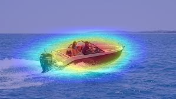

# Project Details

## Visualize class activation maps with TensorFlow(Keras)

## Create a heatmap over the input image and debug your deep learning model!

<p float="left">
  
   
</p>

<p float="left">
  
   
</p>

## Installation

Use the package manager [pip](https://pip.pypa.io/en/stable/) to install requirements.

```bash
pip3 install -r requirements.txt
```

## Usage

```
jupyter notebook
keras-heatmap-CAM-vgg16.ipynb #VGG16
keras-heatmap-CAM-xception.ipynb #Xception
keras-heatmap-CAM-custom-model.ipynb #custom model (Xception TL)
```

## Contributing
Pull requests are welcome. For major changes, please open an issue first to discuss what you would like to change.

## License
[MIT](https://choosealicense.com/licenses/mit/)
